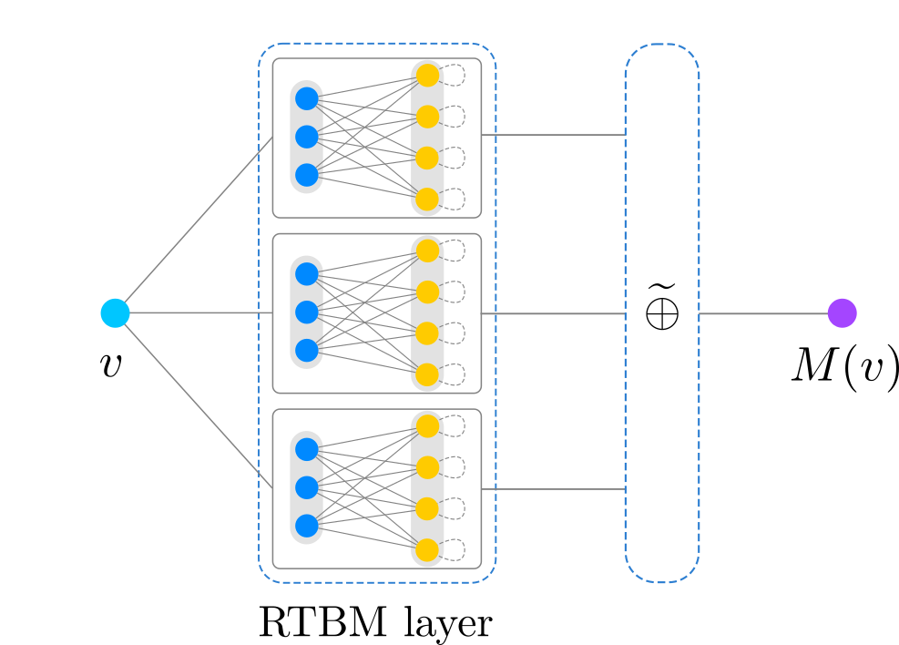

:github_url:

Components
==========

The theta package comes with the following modules:

* RTBM_ (:code:`theta.rtbm`)
* Model_ (:code:`theta.model`)
* Layers_ (:code:`theta.layers`)
* Minimizers_ (:code:`theta.minimizer`)
* Activations_ (:code:`theta.activations`)
* Initializers_ (:code:`theta.initializers`)
* `Cost functions`_ (:code:`theta.costfunctions`)
* `Stopping conditions`_ (:code:`theta.stopping`)

These modules provide all the required components to train
Riemann-Theta Boltzmann Machines for probability density estimation,
regression and classification.

_______________________

.. _RTBM:

RTBM
----

The ``theta.rtbm`` module contains the definition of ``class
RTBM``. This object provides the simplest interface to the parameters
of the RTBM and to the probability and expectation values.

Schematically, the RTBM is given by the network configuration

.. figure:: rtbm.png
   :scale: 30 %
   :align: center

where :math:`T` is the connection matrix of the visible sector with
:math:`N_v` visible units, :math:`Q` of the hidden sector with
:math:`N_h` hidden units and :math:`W` the inter-connections.
      
.. autoclass:: theta.rtbm.RTBM
   :members:
   :inherited-members:
   :exclude-members: Mode, feed_through, backprop, set_parameters, mode, bv, t, bh, w, q
   :member-order: bysource
   
_______________________

.. _Model:

Model
------

The theta package provide a dedicated container for RTBM probability
mixtures models and theta neural networks (TNNs) through the ``class
Model`` stored in ``theta.model``.

This module allows the concatenation of objects for building mixture
model based on multiple RTBMs and a final ``NormAddLayer``, such as:

and the possibility to build TNNs, e.g.:

.. figure:: tnn.png
   :scale: 30 %
   :align: center

Further information about the implemented layers for the TNNs are
listed in the Layers_ section of this document.

.. autoclass:: theta.model.Model
   :members:
   :inherited-members:
   :exclude-members: feed_through, backprop, build_bounds, set_parameters, set_bound
   :member-order: bysource

_______________________

.. _Layers:

Layers
------

The theta package implements the following layers:

* `Theta Probability Unit`_: provides a layer with multiple RTBMs
  setup in probability mode. This layer is used to build probability
  and mixture models.
* `Theta Diagonal Expectation Unit`_: A layer consisting of a RTBM in expectation mode with diagonal :math:`Q`. 
  This layer is suitable for regression and classification applications, and
  can be combined with other layers into a deep model.
* `Normalized Additive`_: performs a weighted sum of the inputs.
  This layer guarantees a positive and normalized output and is used to build mixture
  models.
* `Linear`_: a standard linear layer for testing and benchmarking purposes.
* `Non-Linear`_: a non linear layer for testing and
  benchmarking purposes.

All layers are inherited from the ``theta.layers.Layer`` class, so
custom layers can be implemented by extending that class.

.. _Theta Probability Unit:

Theta Probability Unit
######################

.. autoclass:: theta.layers.ThetaUnitLayer
   :members:
   :inherited-members:
   :exclude-members: feedin, backprop, set_parameters, set_bounds 
   :member-order: bysource

.. _Theta Diagonal Expectation Unit:
		  
Theta Diagonal Expectation Unit
###############################

.. autoclass:: theta.layers.DiagExpectationUnitLayer
   :members:
   :inherited-members:
   :exclude-members: feedin, backprop, set_parameters, set_bounds    
   :member-order: bysource

.. _Normalized Additive:
		  
Normalized Additive
###################

.. autoclass:: theta.layers.NormAddLayer
   :members:
   :inherited-members:
   :exclude-members: feedin, backprop, set_parameters, set_bounds    
   :member-order: bysource

.. _Linear:
		  
Linear
######

.. autoclass:: theta.layers.Linear
   :members:
   :inherited-members:
   :exclude-members: feedin, backprop, set_parameters, set_bounds    
   :member-order: bysource

.. _Non-Linear:
		  
Non-Linear
##########

.. autoclass:: theta.layers.NonLinear
   :members:
   :inherited-members:
   :exclude-members: feedin, backprop, set_parameters, set_bounds    
   :member-order: bysource
       
_______________________

.. _Minimizers:

Minimizers
----------

The theta package provides two minimizers:

* CMA-ES_ (evolutionary strategy)
* `Stochastic Gradient Descent`_ (SGD)

We also provide the ``BFGS`` optimizer for testing purposes.
  
Evolutionary algorithm
######################

.. _CMA-ES:

.. autoclass:: theta.minimizer.CMA
   :members:
   :inherited-members:
   :member-order: bysource
		  
Gradient descent
################

.. _Stochastic Gradient Descent:

.. autoclass:: theta.minimizer.SGD
   :members:
   :inherited-members:
   :member-order: bysource

.. autoclass:: theta.minimizer.BFGS
   :members:
   :inherited-members:
   :member-order: bysource

.. _Gradient descent schemes:
		  
Gradient descent schemes
########################

.. autoclass:: theta.gradientschemes.adagrad
   :members:
   :inherited-members:
   :member-order: bysource

.. autoclass:: theta.gradientschemes.RMSprop
   :members:
   :inherited-members:
   :member-order: bysource

.. autoclass:: theta.gradientschemes.adadelta
   :members:
   :inherited-members:
   :member-order: bysource

.. autoclass:: theta.gradientschemes.adam
   :members:
   :inherited-members:
   :member-order: bysource
   
_______________________

.. _Activations:

Activations
-----------

All activations functions are inherited from the
``theta.activations.actfunc`` class, so custom activations can be
implemented by extending that class.

The current code contains the following activation functions:

Linear
######

.. autoclass:: theta.activations.linear
   :members:
   :inherited-members:
   :member-order: bysource

Sigmoid
#######
		  
.. autoclass:: theta.activations.sigmoid
   :members:
   :inherited-members:
   :member-order: bysource

Tanh
####		  
		  
.. autoclass:: theta.activations.tanh
   :members:
   :inherited-members:
   :member-order: bysource

Custom activation functions can be implemented by extending the ``theta.activations.actfunc`` class.
		  
_______________________

.. _Initializers:

Initializers
------------

All initializers are inherited from the
``theta.initializers.initializer`` class, so custom initializers can
be implemented by extending that class.

The current code contains the following parameter initalizers:

Uniform
#######

.. autoclass:: theta.initializers.uniform
   :members:
   :inherited-members:
   :member-order: bysource

Normal
######

.. autoclass:: theta.initializers.normal
   :members:
   :inherited-members:
   :member-order: bysource

Null
####

.. autoclass:: theta.initializers.null
   :members:
   :inherited-members:
   :member-order: bysource

Glorot normal
#############

.. autoclass:: theta.initializers.glorot_normal
   :members:
   :inherited-members:
   :member-order: bysource

Glorot uniform
##############		  

.. autoclass:: theta.initializers.glorot_uniform
   :members:
   :inherited-members:
   :member-order: bysource

Custom initalization schemes can be easily implemented by extending the ``theta.initializers.initializer`` class.

_______________________

.. _Cost functions:

Cost functions
--------------

All cost functions are inherited from the
``theta.costfunctions.costfunction`` class, so custom costs can be
implemented by extending that class.

The current code contains the following cost functions:

MSE
###

.. autoclass:: theta.costfunctions.mse
   :members:
   :inherited-members:
   :member-order: bysource

Logarithmic
###########

.. autoclass:: theta.costfunctions.logarithmic
   :members:
   :inherited-members:
   :member-order: bysource

Sum
###

.. autoclass:: theta.costfunctions.sum
   :members:
   :inherited-members:
   :member-order: bysource

RMSE
####

.. autoclass:: theta.costfunctions.rmse
   :members:
   :inherited-members:
   :member-order: bysource
	       
_______________________

.. _Stopping conditions:

Stopping conditions
-------------------

The stopping condition can be used with the ``theta.minimizer.SGD``
minimizer. The validation data is monitored and if a specific
condition is achieved the optimization is stopped. Custom stopping
conditions can be implemented by extending the
``theta.minimizer.stopping`` abstract class.

The current code contains the following stopping algorithms:

Early Stop
##########

.. autoclass:: theta.stopping.earlystop
   :members:
   :inherited-members:
   :member-order: bysource
